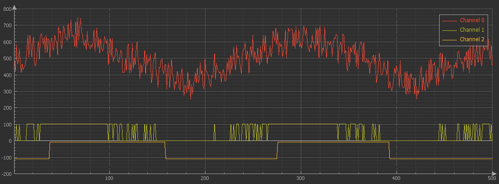
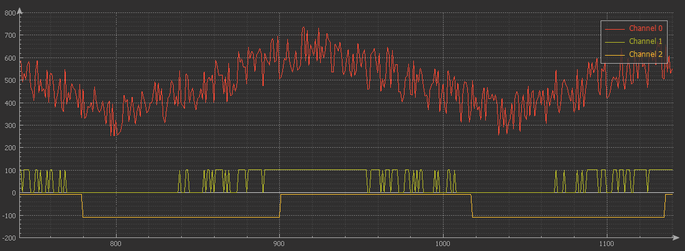

# Hysteresis comparator
Microcontroller Digital signal hysteresis comparator

[Library files](https://github.com/binarymaker/hysteresis-comparator/tree/master/sw-hysteresis-comparator/User-Library/hysteresis)
 
# Concept

```
                      /\/\                             ,  ,
signal            /\/\    /\/\                     /\/\ || /\/\
  threshold->-/\/\------------/\/\-------------/\/\-----||-----/\/\--
                ^               ^  /\/\    /\/\  ^      ||            
                |               |      /\/\      |      ||             
             Noise make error in compare --------+      ^^-spike
                  ____________                     _____  _____       
caparator     ||||            ||||_____________||||     ||     ||||__ 
output
                     ______________                  _______________
hysteresis    ______|              |________________|               |_
comparetor
output

```

# Code usage

```c
/* Include library */
#include "hysteresis.h"

/* Hysteresis comparator objects */
hysteresis_t hy_comp_1;
hysteresis_t hy_comp_2;

void main()
{
   /* Initialization of hysteresis comparator */
   hysteresis_create(&hy_comp_1, 30, 100);  /* 30 - threshold value, 100 - time delay in ms*/
   hysteresis_create(&hy_comp_2, 50, 150);  /* 50 - threshold value, 150 - time delay in ms*/

   while(1)
   {
      signal = signal_source();  /* signal source function may ADC, Capture count, sensor data*/

      /* comparator process
      * 
      * call this function maximum passible short time
      * 
      * Optional: filter signal before compare
      */
      hysteresis_compare(&hy_comp_1, signal);
      hysteresis_compare(&hy_comp_2, signal);

      process_or_print = hy_comp_1.hys_state;
      process_or_print = hy_comp_2.hys_state;
   }
}

```

# Example test code

Refer this [code](https://github.com/binarymaker/hysteresis-comparator/blob/master/sw-hysteresis-comparator/Src/main.c)

## test output

Test parameter
   + Threshold value - 500
   + Comparator time delay - 50ms

Signal
   + channel 1 - Signal + Noise (+/- 100)
   + channel 2 - Normal comparator
   + channel 3 - Hysteresis comparator
  


